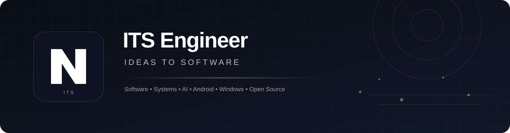
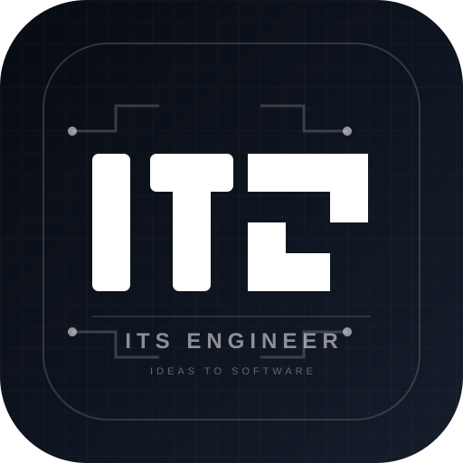

<div align="center">



# ITS Engineer

### Ideas To Software

**Turning ideas into real, working software — from concept to system.**

[](https://github.com/gshellmr-code)
[](https://github.com/gshellmr-code/profile)

</div>

---

## 👋 About Me

I’m **ITS Engineer**, an independent software engineer and technology builder focused on turning ideas into real software.

My work moves across **software engineering, systems development, AI, Android, Windows, automation, operating-system experimentation, developer tooling, and open source**. I enjoy going below the surface of a platform to understand how it actually works — then building, modifying, and improving it.

> **ITS = Ideas To Software**
>
> **Idea → Explore → Engineer → Build → Improve**

ITS Engineer is a personal engineering identity, not a limitation to one language, framework, or platform. The goal is simple: **take an idea and make it work.**

---

## 🧠 Engineering Philosophy

```text
THINK
  ↓
EXPLORE
  ↓
ENGINEER
  ↓
BUILD
  ↓
TEST
  ↓
IMPROVE
```

I believe the best way to understand technology is to work with it directly.

**Build it. Break it. Understand it. Rebuild it better.**

---

## 🛠️ What I Build

| Area | Focus |
| --- | --- |
| 🤖 **AI & Automation** | AI-powered tools, automation, APIs, workflows and developer utilities |
| 🖥️ **Windows Engineering** | Native Windows tooling, Win32 integration, portable applications and system-level work |
| 📱 **Android Engineering** | Android tooling, ADB, runtime experimentation and platform integration |
| ⚙️ **Systems & Runtime** | Low-level architecture, processes, graphics pipelines, virtualization and system components |
| 🔬 **Technical Research** | Reverse engineering, binary analysis, implementation research and architecture discovery |
| 🧰 **Developer Tools** | Utilities, installers, GUI applications, build systems and productivity tooling |
| 🌐 **Web & Applications** | Modern web applications, interfaces, APIs and project infrastructure |
| 🧪 **Experimental Projects** | New runtimes, OS concepts, platform experiments and ideas that do not fit one category |

---

## 🚀 Featured Work

### 🪟 WSA / Windows Subsystem for Android

Research and engineering around **WSA**, Android application integration on Windows, ADB connectivity, window integration, rendering architecture and system-level tooling.

### 📦 WSA Installer Ecosystem

Work around installers, Windows configuration, Android environment setup, system checks, portable tooling and improving the experience of working with WSA-related software.

### 🌐 WSA Installer Website

A web project supporting the WSA Installer ecosystem and its public-facing experience.

### 🔐 Accounts-Pocket

An independent project focused on organizing account-related information and project data in a structured repository workflow.

> Featured projects are selected from my public GitHub work. For the complete and current project list, visit my repositories.

---

## 💻 Technology Stack

### Languages

`Python` · `C` · `C++` · `Java` · `JavaScript` · `TypeScript` · `Dart`

### Windows & Systems

`Windows 11` · `Win32` · `WSA` · `ADB` · `Virtualization` · `Process Architecture` · `Graphics & Rendering`

### UI & Application Development

`PySide6` · `Qt` · `QML` · `Tkinter` · `Web Applications`

### Build & Tooling

`Git` · `GitHub` · `CMake` · `Meson` · `Ninja` · `MSYS2` · `GCC` · `Clang` · `Nuitka`

### AI & Automation

`AI APIs` · `Automation` · `Developer Tooling` · `System Utilities`

---

## 🔬 Technical Interests

- **Systems Architecture**
- **Runtime Architecture**
- **Android Internals**
- **Windows Internals**
- **Graphics & Rendering Pipelines**
- **Virtualization & Emulation**
- **ADB & Platform Tooling**
- **Reverse Engineering**
- **Portable Software**
- **AI-assisted Development**
- **Automation**
- **Open Source Engineering**

---

## 📊 GitHub

<div align="center">

<a href="https://github.com/gshellmr-code">
  
</a>
<a href="https://github.com/gshellmr-code">
  
</a>

<br/>

<a href="https://github.com/gshellmr-code">
  
</a>

</div>

---

## 📌 Current Direction

I’m continuing to explore the boundary between **applications and systems** — especially where Windows, Android, AI, virtualization, graphics, and developer tooling meet.

The long-term goal is not simply to write code, but to understand complete systems and turn ambitious ideas into usable software.

---

## 🌟 Open Source

This profile is a home for my independent experiments, engineering projects, research, utilities, and open-source work.

If something here is useful, feel free to explore it, fork it, improve it, or build something new from it.

---

<div align="center">

### **ITS Engineer**

**Ideas To Software.**

*Think it. Engineer it. Build it.*



</div>
